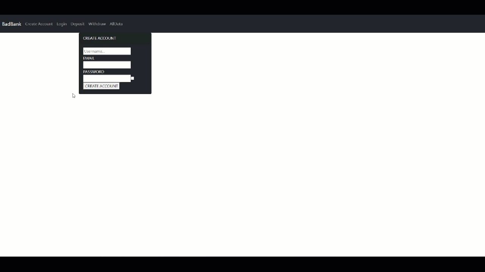

# Banking Application

> Version 1.0.0.1

A project to create a bank account and do banking transactions.

## How to use

1. **Download** the project by using git commands.
2. **Install javascript dependencies** by running "npm install".
3. **Install Docker** in your computer from the [Docker](https://www.docker.com/products/docker-desktop) page.
4. **Install Mongo DB** by running in the command line the following commands:
    1. docker pull mongo
    2. docker run -p 27017:27017 --name bank -d mongo
5. **Start Frontend** by running "npm start" in the command line.
6. **Start Backend** by running "node index.js" in another command line.
7. **Enjoy** by interacting with the app from the port 3000 in your browser.

## What we used for the project

In this project we are using:
- **React** as the framework for the front end
- **Bootstrap** to improve the front end appearance
- **Formik** for the form values validation and interaction
- **Node JS** as the backend server to interact with the project's database
- **Mongo DB** to store the application's data

## Features

- **Create account** to add more fun
- **Secure authentication** to add more fun
- **Secure banking transactions** to add more fun

## LICENSE

This project is under the MIT license

## Maintainers
Who worked on this:
- [Simon Capriles](https://simoncapriles.github.io/)

## Support

Found some issues?  
Write to this email: <a href="mailto:info@kyohei.com.bo"><i class="font-icon icon-envelope"></i>info@kyohei.com.bo</a>

## Github

Want to download or fork the project?  
Find it on Github: [PacMen-Exercise](https://github.com/SimonCapriles/PacMen-Exercise)